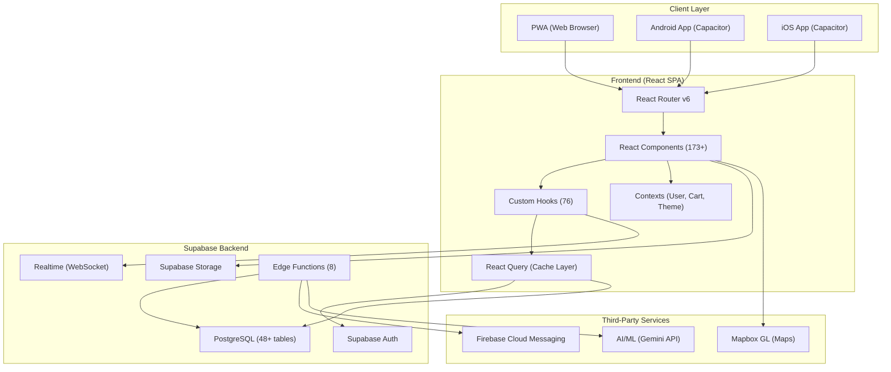
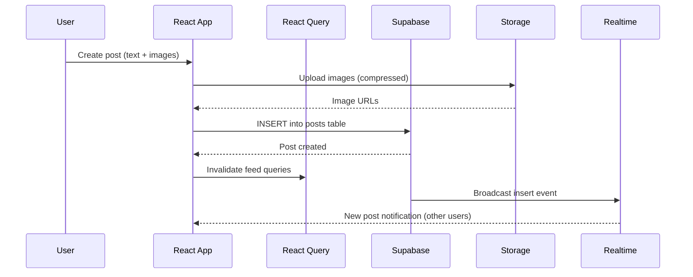
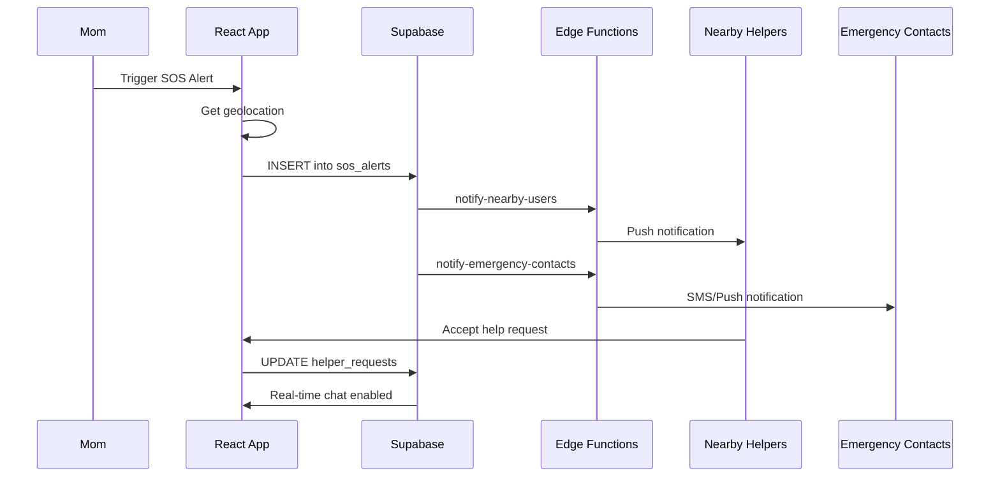

# 🏗 MomsNest — System Architecture Document

**Version:** 1.0  
**Date:** March 4, 2026  

---

## 1. Architecture Overview

MomsNest follows a **modern JAMstack architecture** with a serverless backend:

- **Frontend:** React SPA (Single Page Application) with client-side routing
- **Backend:** Supabase (PostgreSQL + Auth + Realtime + Storage + Edge Functions)
- **Native Wrapper:** Capacitor (Android & iOS)
- **Deployment:** PWA-first with native app builds

This is a **monolithic frontend** with a **Backend-as-a-Service (BaaS)** pattern — not a traditional microservices architecture. All business logic lives either in the React client or Supabase Edge Functions/RLS policies.

---

## 2. Architecture Diagram



---

## 3. Tech Stack

### Frontend
| Technology | Version | Purpose |
|-----------|---------|---------|
| **React** | 18.3.1 | UI framework |
| **TypeScript** | 5.8.3 | Type safety |
| **Vite** | 5.4.19 | Build tool & dev server |
| **React Router** | 6.30.1 | Client-side routing (32 routes) |
| **TanStack React Query** | 5.83.0 | Server state management & caching |
| **Tailwind CSS** | 3.4.17 | Utility-first styling |
| **shadcn/ui** | Latest | Component library (Radix UI primitives) |
| **Lucide React** | 0.462.0 | Icon library |
| **Recharts** | 2.15.4 | Data visualization |
| **Zod** | 3.25.76 | Schema validation |
| **React Hook Form** | 7.61.1 | Form management |
| **date-fns** | 3.6.0 | Date utilities |
| **Sonner** | 1.7.4 | Toast notifications |
| **cmdk** | 1.1.1 | Command palette |

### Native Mobile (Capacitor)
| Plugin | Version | Purpose |
|--------|---------|---------|
| **@capacitor/core** | 7.4.2 | Bridge to native APIs |
| **@capacitor/android** | 7.4.2 | Android platform |
| **@capacitor/ios** | 7.4.2 | iOS platform |
| **@capacitor/camera** | 8.0.1 | Camera access |
| **@capacitor/haptics** | 8.0.1 | Haptic feedback |
| **@capacitor/keyboard** | 8.0.1 | Keyboard management |
| **@capacitor/push-notifications** | 8.0.1 | Push notifications |
| **@capacitor/preferences** | 8.0.1 | Persistent key-value storage |
| **@capacitor/network** | 8.0.1 | Network status detection |
| **@capacitor/filesystem** | 8.1.2 | File system access |
| **@capacitor/splash-screen** | 8.0.1 | Splash screen control |
| **@capacitor/status-bar** | 8.0.1 | Status bar customization |

### Backend (Supabase)
| Service | Purpose |
|---------|---------|
| **PostgreSQL** | Primary database (48+ tables, 69 migrations) |
| **Supabase Auth** | Authentication (email/password) |
| **Supabase Realtime** | WebSocket subscriptions for live updates |
| **Supabase Storage** | File/media storage (images, videos) |
| **Edge Functions (Deno)** | Serverless business logic |
| **Row Level Security** | Database access control policies |

### Third-Party APIs
| API | Purpose |
|-----|---------|
| **Mapbox GL JS** | Interactive maps for SOS/Safety |
| **HLS.js** | HTTP Live Streaming for video |
| **WebRTC** | Real-time live streaming |

---

## 4. API Structure

### Supabase Client API
The frontend communicates with Supabase through the official JavaScript client (`@supabase/supabase-js`):

```
supabase.auth.*          → Authentication operations
supabase.from('table')   → Database CRUD operations
supabase.storage.*       → File upload/download
supabase.functions.*     → Edge Function invocation
supabase.channel('name') → Realtime subscriptions
```

### Edge Functions (8 total)

| Function | Trigger | Purpose |
|----------|---------|---------|
| `generate-ai-insight` | On-demand | Generate AI-powered parenting insights for Q&A |
| `get-mapbox-token` | On-demand | Securely provide Mapbox API token to client |
| `notify-all-users` | On-demand | Broadcast push notification to all users |
| `notify-emergency-contacts` | SOS event | Alert a user's emergency contacts |
| `notify-helper-request` | SOS event | Send notification to nearby helpers |
| `notify-live-start` | Live event | Notify followers when a user goes live |
| `notify-nearby-users` | SOS event | Alert users within proximity of emergency |
| `send-push-notification` | On-demand | Send targeted push notification via FCM |

---

## 5. Data Flow Diagram

### Post Creation Flow


### SOS Alert Flow


---

## 6. Component Architecture

```
src/
├── App.tsx                      # Root component with providers
├── components/
│   ├── ui/                      # shadcn/ui base components (51)
│   ├── safe/                    # SOS/Safety components (25)
│   ├── shop/                    # Marketplace components (18)
│   ├── circles/                 # Community circle components (20)
│   ├── ask/                     # Q&A components (8)
│   ├── live/                    # Live streaming components (5)
│   ├── wallet/                  # Wallet components (1)
│   ├── messages/                # Messaging components (2)
│   └── [43 shared components]   # Feed, header, footer, modals, etc.
├── contexts/
│   ├── UserContext.tsx           # Auth state & profile
│   ├── CartContext.tsx           # Shopping cart state
│   └── ThemeContext.tsx          # Theme preferences
├── hooks/                       # 76 custom hooks
├── pages/                       # 32 route pages
├── types/                       # TypeScript type definitions
├── utils/                       # Utility functions
├── data/                        # Mock/static data
└── integrations/supabase/       # Supabase client & auto-generated types
```

### Provider Hierarchy
```
ThemeProvider
  └── QueryClientProvider (React Query)
      └── UserProvider (Auth)
          └── CartProvider (Shopping Cart)
              └── TooltipProvider
                  └── BrowserRouter
                      └── Routes
```
