# 🗄 MomsNest — Database Documentation

**Version:** 1.0  
**Date:** March 4, 2026  
**Database:** PostgreSQL (via Supabase)  
**Migrations:** 69 total  

---

## 1. ER Diagram (Simplified)

```mermaid
erDiagram
    profiles ||--o{ posts : creates
    profiles ||--o{ comments : writes
    profiles ||--o{ likes : gives
    profiles ||--o{ saves : bookmarks
    profiles ||--o{ follows : follows
    profiles ||--|| profile_stats : has
    profiles ||--|| coin_wallets : owns
    profiles ||--o| seller_profiles : has
    profiles ||--o| helper_profiles : has
    profiles ||--o| expert_profiles : has
    profiles ||--o{ stories : posts
    profiles ||--o{ questions : asks
    profiles ||--o{ answers : provides
    profiles ||--o{ orders : places
    profiles ||--o{ shop_items : sells
    profiles ||--o{ sos_alerts : triggers
    profiles ||--o{ circle_members : joins
    profiles ||--o{ live_streams : hosts

    posts ||--o{ comments : has
    posts ||--o{ likes : receives
    posts ||--o{ saves : receives
    posts ||--|| post_stats : has
    posts }o--o| circles : belongs_to

    circles ||--o{ circle_members : has
    circles ||--o{ circle_events : hosts
    circles ||--o{ circle_services : offers
    circles ||--o{ circle_resources : contains
    circles ||--|| circle_stats : has

    shop_items ||--o{ order_items : ordered_as
    shop_items ||--o{ flash_sales : featured_in
    shop_items ||--o{ group_buys : grouped_in
    shop_items ||--o{ product_reviews : reviewed_in
    shop_items ||--|| shop_item_stats : has

    orders ||--o{ order_items : contains
    orders ||--o{ disputes : may_have
    orders ||--o{ refunds : may_have

    sos_alerts ||--o{ sos_helpers : attracts
    sos_alerts ||--o{ sos_messages : has
    sos_alerts ||--o{ helper_requests : generates

    conversations ||--o{ conversation_members : has
    conversations ||--o{ messages : contains

    live_streams ||--o{ live_messages : has
    live_streams ||--o{ live_viewers : watched_by

    questions ||--o{ answers : receives
    questions ||--o{ question_votes : receives
```

---

## 2. Schema Design — Complete Table List

### User Domain (6 tables)
| Table | Description | PK |
|-------|-------------|-----|
| `profiles` | User profiles (linked to Supabase Auth) | `id` (UUID, matches auth.users.id) |
| `profile_stats` | Aggregate counts per user | `user_id` (FK → profiles) |
| `follows` | Follower/following relationships | `id` |
| `seller_profiles` | Seller-specific info (business, verification) | `user_id` (FK → profiles, 1:1) |
| `helper_profiles` | SOS helper info (availability, skills, ratings) | `user_id` (FK → profiles) |
| `expert_profiles` | Q&A expert info (specialty, certifications) | `id` |

### Social Feed Domain (7 tables)
| Table | Description | PK |
|-------|-------------|-----|
| `posts` | User posts (text, images, circle posts) | `id` |
| `post_stats` | Aggregate stats per post | `post_id` (FK → posts, 1:1) |
| `post_unlocks` | Premium content unlock records | `id` |
| `comments` | Threaded comments on posts | `id` |
| `comment_likes` | Likes on comments | `id` |
| `likes` | Post likes | `id` |
| `saves` | Post bookmarks | `id` |

### Stories Domain (2 tables)
| Table | Description | PK |
|-------|-------------|-----|
| `stories` | Ephemeral 24-hour stories | `id` |
| `story_likes` | Story reactions | `id` |

### Circles Domain (10 tables)
| Table | Description | PK |
|-------|-------------|-----|
| `circles` | Community groups | `id` |
| `circle_members` | Group membership (role-based) | `id` |
| `circle_stats` | Aggregate circle metrics | `circle_id` (1:1) |
| `circle_events` | Events within circles | `id` |
| `circle_event_attendees` | Event registration/RSVP | `id` |
| `circle_services` | Bookable services | `id` |
| `circle_service_bookings` | Service booking records | `id` |
| `circle_resources` | Downloadable resources | `id` |
| `circle_subscriptions` | Premium circle subscriptions | `id` |
| `circle_tips` | Tips on circle posts | `id` |

### Marketplace Domain (15 tables)
| Table | Description | PK |
|-------|-------------|-----|
| `shop_items` | Product listings | `id` |
| `shop_item_stats` | Product engagement metrics | `item_id` (1:1) |
| `shop_item_likes` | Product likes | `id` |
| `shop_item_saves` | Product saves/wishlist | `id` |
| `shop_item_comments` | Product comments (threaded) | `id` |
| `orders` | Order headers | `id` |
| `order_items` | Order line items | `id` |
| `shipping_addresses` | User shipping addresses | `id` |
| `payment_methods` | Saved payment methods | `id` |
| `flash_sales` | Time-limited sales | `id` |
| `group_buys` | Group purchase deals | `id` |
| `group_buy_participants` | Group buy participation | `id` |
| `product_reviews` | Item reviews with ratings | `id` |
| `review_helpful` | Review helpfulness votes | `id` |
| `disputes` | Order disputes | `id` |
| `refunds` | Refund records | `id` |
| `seller_follows` | Seller following | `id` |
| `seller_reviews` | Seller reviews | `id` |
| `seller_stats` | Aggregate seller metrics | `seller_id` (1:1) |
| `shop_conversations` | Buyer-seller chat threads | `id` |
| `shop_messages` | Messages within shop conversations | `id` |

### Q&A Domain (5 tables)
| Table | Description | PK |
|-------|-------------|-----|
| `questions` | User-posted questions | `id` |
| `answers` | Responses to questions | `id` |
| `answer_votes` | Answer helpfulness votes | `id` |
| `question_votes` | Question upvotes | `id` |
| `question_bookmarks` | Saved questions | `id` |

### Safety/SOS Domain (7 tables)
| Table | Description | PK |
|-------|-------------|-----|
| `sos_alerts` | Emergency alerts | `id` |
| `sos_helpers` | Helpers responding to alerts | `id` |
| `sos_messages` | Chat within SOS alerts | `id` |
| `sos_reviews` | Reviews of helper performance | `id` |
| `helper_requests` | Helper dispatch requests | `id` |
| `emergency_contacts` | User emergency contacts | `id` |
| `abuse_reports` | Abuse/moderation reports | `id` |

### Messaging Domain (2 tables)
| Table | Description | PK |
|-------|-------------|-----|
| `conversations` | Direct message threads | `id` |
| `conversation_members` | Participants in conversations | `id` |
| `messages` | Individual messages | `id` |

### Live Streaming Domain (3 tables)
| Table | Description | PK |
|-------|-------------|-----|
| `live_streams` | Live broadcast sessions | `id` |
| `live_messages` | Chat during live streams | `id` |
| `live_viewers` | Active viewer tracking | `id` |

### Financial Domain (3 tables)
| Table | Description | PK |
|-------|-------------|-----|
| `coin_wallets` | User coin balance | `user_id` (1:1) |
| `coin_transactions` | Transaction ledger | `id` |
| `coin_topups` | Coin purchase records | `id` |
| `coin_withdrawals` | Cash-out requests | `id` |

### Notifications Domain (2 tables)
| Table | Description | PK |
|-------|-------------|-----|
| `push_notifications` | Push notification records | `id` |
| `notification_preferences` | Per-user notification settings | `id` |

---

## 3. Key Table Relationships

| Relationship | Type | Description |
|-------------|------|-------------|
| profiles → profile_stats | 1:1 | Every profile has exactly one stats record |
| profiles → coin_wallets | 1:1 | One wallet per user |
| profiles → seller_profiles | 1:0..1 | Optional seller profile |
| profiles → posts | 1:N | User creates many posts |
| posts → post_stats | 1:1 | Denormalized stats per post |
| posts → circles | N:0..1 | Post optionally belongs to a circle |
| circles → circle_members | 1:N | Circle has many members |
| shop_items → order_items | 1:N | Item appears in many orders |
| orders → order_items | 1:N | Order contains many line items |
| sos_alerts → sos_helpers | 1:N | Alert dispatches many helpers |
| conversations → messages | 1:N | Conversation has many messages |

---

## 4. Indexing Strategy

Supabase automatically creates indexes on:
- All primary keys (UUID)
- All foreign key columns
- Unique constraints

### Recommended Additional Indexes

| Table | Column(s) | Type | Rationale |
|-------|----------|------|-----------|
| `posts` | `created_at DESC` | B-tree | Feed chronological sorting |
| `posts` | `user_id, created_at DESC` | Composite | User profile feed |
| `posts` | `circle_id, created_at DESC` | Composite | Circle feed |
| `shop_items` | `category, status, created_at` | Composite | Shop browsing/filtering |
| `sos_alerts` | `status, location_lat, location_lng` | Composite | Nearby alert queries |
| `messages` | `conversation_id, created_at` | Composite | Chat history loading |
| `profiles` | `username` | Unique | Username lookups |
| `follows` | `follower_id, following_id` | Unique composite | Prevent duplicate follows |
| `likes` | `user_id, post_id` | Unique composite | Prevent duplicate likes |

---

## 5. Database Enums

| Enum | Values | Used In |
|------|--------|---------|
| `coin_transaction_type` | `earned`, `spent`, `topup`, `withdrawal`, `tip`, etc. | `coin_transactions.type` |

---

## 6. Backup Strategy

| Component | Strategy | Frequency |
|-----------|----------|-----------|
| **Database** | Supabase Pro Point-in-Time Recovery (PITR) | Continuous (every transaction) |
| **Storage** | Supabase Storage with CDN replication | Automatic |
| **Migrations** | Version-controlled in `supabase/migrations/` (69 files) | Every schema change |
| **Schema** | Auto-generated TypeScript types (`types.ts`, 4,029 lines) | On each migration |

---

## 7. Data Retention

| Data Type | Retention Policy |
|-----------|-----------------|
| User profiles | Until account deletion |
| Posts & comments | Indefinite (user can delete own) |
| Stories | Auto-expire after 24 hours |
| SOS alerts | Retained for safety/legal (7 years) |
| Messages | Indefinite (users can delete conversations) |
| Coin transactions | Indefinite (financial records) |
| Push notifications | 90 days |
| Session tokens | Until expiry/logout |
