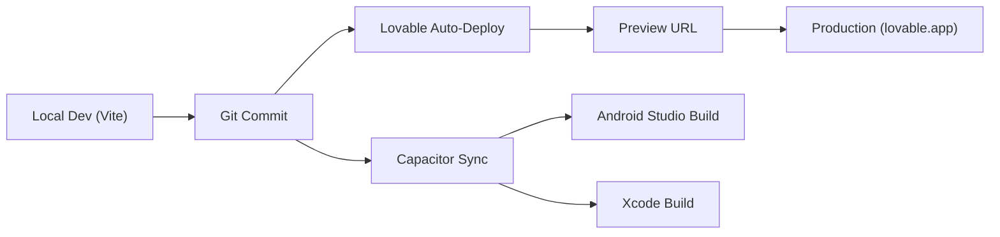

# ⚙️ MomsNest — Infrastructure & DevOps Documentation

**Version:** 1.0  
**Date:** March 4, 2026  

---

## 1. Hosting Environment

| Layer | Service | Details |
|-------|---------|---------|
| **Frontend Hosting** | Lovable (Cloudflare Pages) | Global CDN, auto-deploy from Git |
| **Backend** | Supabase Cloud | Managed PostgreSQL, Auth, Realtime, Storage |
| **Edge Functions** | Supabase Edge (Deno Deploy) | 8 serverless functions, globally distributed |
| **Maps** | Mapbox Cloud | Tile serving, geocoding APIs |
| **Push Notifications** | Firebase Cloud Messaging (FCM) | Android & Web push |
| **Android Build** | Capacitor CLI + Android Studio | Local builds, APK/AAB generation |
| **iOS Build** | Capacitor CLI + Xcode | Local builds (requires macOS) |
| **Domain/CDN** | Cloudflare (via Lovable) | SSL, HTTP/2, edge caching |

---

## 2. CI/CD Pipeline

### Current Workflow


### Build Commands
```bash
# Development
npm run dev              # Start Vite dev server (HMR)

# Production build
npm run build            # Vite production build → dist/

# Mobile sync
npx cap sync             # Sync web build → native projects
npx cap open android     # Open in Android Studio
npx cap open ios         # Open in Xcode

# Linting
npm run lint             # ESLint check

# Testing
npx playwright test      # End-to-end tests
```

### Environment Variables
```
VITE_SUPABASE_URL=https://xxx.supabase.co
VITE_SUPABASE_PUBLISHABLE_KEY=eyJhbGciOiJIUzI1NiIsInR5cCI6IkpXVCJ9...
```

---

## 3. Deployment Process

### Web (PWA)
1. Push code to main branch
2. Lovable automatically triggers build
3. Vite bundles React app with tree-shaking and code-splitting
4. Deploy to Cloudflare CDN globally
5. Service worker auto-updates with `vite-plugin-pwa`

### Android
1. Run `npm run build` to generate `dist/`
2. Run `npx cap sync android` to copy web assets
3. Open Android Studio: `npx cap open android`
4. Build APK/AAB for distribution (Play Store or direct)
5. Capacitor config: `capacitor.config.json` (appId: `com.momsnest.app`)

### Database Migrations
1. Migrations stored in `supabase/migrations/` (69 files)
2. Apply via Supabase CLI: `supabase db push`
3. TypeScript types regenerated: `supabase gen types typescript`

---

## 4. Scaling Strategy

| Component | Current | Scale-Up Path |
|-----------|---------|---------------|
| **Database** | Supabase Free/Pro | Upgrade to Supabase Pro → Enterprise |
| **Realtime connections** | 200 concurrent | Enterprise plan for 10K+ connections |
| **Storage** | Supabase Storage | CDN caching, image compression before upload |
| **Edge Functions** | 500K invocations/mo | Increase plan, add regional deployments |
| **Frontend** | Global CDN | Already globally distributed via Cloudflare |
| **Video** | HLS streaming | Consider dedicated video CDN (Mux, Cloudflare Stream) |
| **Search** | PostgreSQL `ilike` | Migrate to full-text search or Algolia |

---

## 5. Disaster Recovery Plan

| Scenario | Recovery Strategy | RTO | RPO |
|----------|-------------------|-----|-----|
| **Database failure** | Supabase automatic failover + PITR | < 5 min | 0 (continuous backup) |
| **Frontend CDN outage** | PWA service worker serves cached version | Instant (cached) | Last visit |
| **Edge Function errors** | Retry logic in client, fallback UI | < 1 min | N/A |
| **Storage outage** | CDN cache serves existing assets | Varies | Last upload |
| **Auth provider down** | Cached sessions persist locally | Users stay logged in | N/A |
| **Complete Supabase outage** | Offline mode + local cache + retry queue | Degraded (read-only) | Last sync |

---

## 6. Monitoring & Observability

| Tool | Purpose | Implementation |
|------|---------|----------------|
| **Supabase Dashboard** | Database metrics, auth sessions, storage usage | Built-in |
| **Browser DevTools** | Frontend performance, network, console logs | Built-in |
| **React Query DevTools** | Cache state inspection | `@tanstack/react-query-devtools` |
| **Error Boundary** | Catch React rendering errors | `ErrorBoundary.tsx` component |
| **Console Logging** | Application-level logging | `console.error/warn/log` throughout |
| **Network Status** | Connectivity monitoring | `useNetworkStatus` hook |
| **Cache Manager** | Version checking, service worker updates | `cacheManager.ts` |

---

# 🔐 MomsNest — Security Documentation

---

## 1. Authentication System

| Aspect | Implementation |
|--------|---------------|
| **Provider** | Supabase Auth (GoTrue) |
| **Method** | Email + Password |
| **Token Type** | JWT (JSON Web Token) |
| **Token Storage** | `localStorage` (web), `@capacitor/preferences` (native) |
| **Session Persistence** | Auto-refresh with `autoRefreshToken: true` |
| **Session Duration** | 1 hour access token, 7-day refresh token (Supabase defaults) |
| **URL Auth Detection** | Disabled on native (`detectSessionInUrl: false`) |

### Auth Error Handling
- Token refresh failure → auto sign-out → redirect to `/login`
- Session errors → clear session → redirect to `/login`
- Profile fetch JWT errors → sign-out + redirect

---

## 2. Authorization Roles

| Role | Scope | Permissions |
|------|-------|-------------|
| **Authenticated User** | App-wide | CRUD own content, read public content, follow, like, comment |
| **Circle Admin** | Circle-level | Manage members, edit circle, create events/services |
| **Circle Member** | Circle-level | Post, comment, access resources within joined circles |
| **Seller** | Shop-level | List products, manage orders, view analytics |
| **Helper** | SOS-level | Accept help requests, track location, communicate with alerter |
| **Expert** | Q&A-level | Verified badge on answers, featured answers |
| **Anonymous** | Read-only | No account required for public pages (login/signup only) |

### Row Level Security (RLS)
All Supabase tables have RLS enabled. Key policies:
- Users can only read/update their own profile
- Users can only delete their own posts/comments
- Order data restricted to buyer and seller
- SOS data accessible to alert creator and accepted helpers
- Follows/likes/saves restricted to authenticated users

---

## 3. Data Encryption

| Layer | Method |
|-------|--------|
| **In Transit** | TLS 1.3 (HTTPS) for all API calls |
| **At Rest** | Supabase encrypts database and storage at rest (AES-256) |
| **Auth Tokens** | JWT signed with HS256 secret |
| **Environment Secrets** | Stored in `.env` file (not committed to git) |
| **Edge Function Secrets** | Supabase Vault (encrypted secrets store) |

---

## 4. Data Compliance

| Regulation | Status | Notes |
|-----------|--------|-------|
| **GDPR** | Partially compliant | User data export/deletion capability needed |
| **Ethiopian Data Protection** | Awareness stage | Ethiopian Data Protection Proclamation (2019) |
| **Children's Data** | N/A | Platform minimum age is 18+ |
| **Cookie Consent** | Not needed | App does not use third-party tracking cookies |
| **Data Residency** | Supabase region-based | Can select deployment region |

---

## 5. Security Measures

| Measure | Implementation |
|---------|---------------|
| **Input Validation** | Zod schema validation on all forms |
| **XSS Prevention** | React's default JSX escaping |
| **CSRF Protection** | JWT-based auth (no cookies for API) |
| **SQL Injection** | Supabase parameterized queries (no raw SQL from client) |
| **File Upload Validation** | Image compression + type checking before upload |
| **Rate Limiting** | Supabase built-in rate limits per endpoint |
| **Abuse Reporting** | User-facing abuse report modal with categories |
| **Legal Disclaimers** | SOS legal disclaimer modal before first use |
| **Location Privacy** | Location sharing is opt-in, privacy modal before sharing |

---

## 6. Security Checklist

- [x] HTTPS enforced on all endpoints
- [x] JWT-based authentication
- [x] Row Level Security on all tables
- [x] Passwords hashed by Supabase Auth (bcrypt)
- [x] Environment variables for sensitive config
- [x] Input validation with Zod
- [x] Error boundaries to prevent data leaks
- [ ] Automated penetration testing
- [ ] Security audit by third party
- [ ] GDPR data export/deletion endpoints
- [ ] Rate limiting on custom edge functions
- [ ] Content Security Policy (CSP) headers
