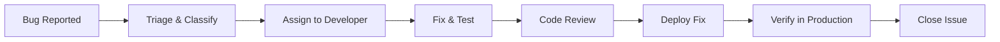

# 🧪 MomsNest — Testing Documentation

**Version:** 1.0  
**Date:** March 4, 2026  

---

## 1. Test Plan

### 1.1 Testing Strategy

| Level | Type | Tool | Coverage Target |
|-------|------|------|-----------------|
| **E2E** | End-to-end browser tests | Playwright | Critical user flows |
| **Component** | Visual/behavior testing | React Testing Library (planned) | UI components |
| **Unit** | Logic/utility functions | Vitest (planned) | Utility functions, hooks |
| **API** | Database/edge function testing | Supabase CLI | Edge functions |
| **Manual** | Exploratory testing | Browser + Android device | Full app |

### 1.2 Tools Used

| Tool | Version | Purpose |
|------|---------|---------|
| **Playwright** | 1.55.0 | E2E browser testing |
| **ESLint** | 9.32.0 | Static code analysis |
| **TypeScript** | 5.8.3 | Type checking (compile-time validation) |
| **React Error Boundary** | Custom | Runtime error catching |
| **Supabase CLI** | Latest | Database migration testing |

### 1.3 Test Environment

| Environment | URL | Purpose |
|-------------|-----|---------|
| **Local Development** | `http://localhost:5173` | Developer testing |
| **Preview Deployment** | Auto-generated Lovable URL | PR review / QA |
| **Production** | `https://momsnest.lovable.app` | Live users |
| **Android Emulator** | Local | Native feature testing |

---

## 2. Test Cases

### 2.1 Authentication Tests

| ID | Test Case | Steps | Expected Result |
|----|-----------|-------|-----------------|
| AUTH-01 | Sign up with email | Enter email, password, name → Submit | Account created, redirected to home |
| AUTH-02 | Sign in with valid credentials | Enter registered email + password | Logged in, session persisted |
| AUTH-03 | Sign in with invalid password | Enter wrong password | Error toast, "Invalid credentials" |
| AUTH-04 | Session persistence | Login → Close app → Reopen | User still logged in |
| AUTH-05 | Sign out | Tap Settings → Sign Out | Redirected to login, session cleared |
| AUTH-06 | Token refresh | Wait > 1 hour after login | Session auto-refreshed silently |

### 2.2 Feed Tests

| ID | Test Case | Expected Result |
|----|-----------|-----------------|
| FEED-01 | View feed on login | Posts displayed chronologically |
| FEED-02 | Create text post | Post appears in feed |
| FEED-03 | Create post with images | Images compressed and uploaded |
| FEED-04 | Like a post | Heart icon toggles, like count increments |
| FEED-05 | Comment on post | Comment appears in threaded view |
| FEED-06 | Reply to comment | Nested reply renders correctly |
| FEED-07 | Save post | Post appears in user saves |
| FEED-08 | Delete own post | Post removed from feed |
| FEED-09 | Pull to refresh | Feed reloads with fresh data |

### 2.3 Shop Tests

| ID | Test Case | Expected Result |
|----|-----------|-----------------|
| SHOP-01 | Browse shop items | Items displayed with images & prices |
| SHOP-02 | Search for product | Filtered results shown |
| SHOP-03 | Add to cart | Item added, badge count updates |
| SHOP-04 | Update cart quantity | Subtotal recalculates |
| SHOP-05 | Checkout flow | Order created, confirmation shown |
| SHOP-06 | Add shipping address | Address saved and selectable |
| SHOP-07 | View order history | Past orders listed with status |
| SHOP-08 | File dispute | Dispute created against order |
| SHOP-09 | Seller list product | Product appears in shop |
| SHOP-10 | Seller update order status | Buyer sees status change |

### 2.4 SOS/Safety Tests

| ID | Test Case | Expected Result |
|----|-----------|-----------------|
| SOS-01 | Create SOS alert | Alert created, nearby users notified |
| SOS-02 | Share location | Map shows user's location |
| SOS-03 | Accept helper request | Helper status updated |
| SOS-04 | SOS messaging | Real-time chat works |
| SOS-05 | Resolve alert | Alert status changes to resolved |
| SOS-06 | Emergency contact notify | Edge function triggers notification |
| SOS-07 | Legal disclaimer | Modal shown on first SOS use |
| SOS-08 | Abuse report | Report submitted and stored |

### 2.5 Circles Tests

| ID | Test Case | Expected Result |
|----|-----------|-----------------|
| CIR-01 | Create circle | Circle created with name, description |
| CIR-02 | Join circle | User added as member |
| CIR-03 | Post in circle | Post appears in circle feed |
| CIR-04 | Create event | Event with RSVP available |
| CIR-05 | Book service | Booking confirmed |
| CIR-06 | Upload resource | File uploaded and downloadable |
| CIR-07 | Tip creator | Coins deducted, tip recorded |

### 2.6 Video & Live Tests

| ID | Test Case | Expected Result |
|----|-----------|-----------------|
| VID-01 | Browse video feed | Vertical video feed loads |
| VID-02 | Play video | HLS streaming plays smoothly |
| VID-03 | Like video | Like count increments |
| VID-04 | Go live | Live stream starts, viewers see feed |
| VID-05 | Live chat | Messages appear in real-time |
| VID-06 | End live | Stream archived |

### 2.7 Wallet Tests

| ID | Test Case | Expected Result |
|----|-----------|-----------------|
| WAL-01 | View balance | Current coin balance shown |
| WAL-02 | View transactions | Transaction history listed |
| WAL-03 | Top up coins | Balance increases after top-up |
| WAL-04 | Unlock premium content | Coins deducted, content accessible |

---

## 3. Bug Tracking Process

### 3.1 Issue Reporting Workflow


### 3.2 Severity Classification

| Severity | Description | Response Time | Example |
|----------|-------------|---------------|---------|
| **P0 — Critical** | App is unusable, data loss, security breach | < 4 hours | Auth broken, SOS not working |
| **P1 — High** | Major feature broken, no workaround | < 24 hours | Checkout fails, posts not loading |
| **P2 — Medium** | Feature issue with workaround | < 3 days | Image upload slow, UI glitch |
| **P3 — Low** | Minor cosmetic issue | Next sprint | Alignment issue, typo |
| **P4 — Enhancement** | Feature request or improvement | Backlog | New filter option, UI polish |

---

# 🎨 MomsNest — Design Documentation

---

## 1. Design System

### Brand Colors
| Name | Hex | Usage |
|------|-----|-------|
| **Primary** | `#4B164C` | Brand color, headers, CTAs |
| **Primary Light** | Derived | Hover states, backgrounds |
| **Background** | `#FFFFFF` | Main background |
| **Text Primary** | `#1A1A2E` | Body text |
| **Text Secondary** | `#6B7280` | Captions, metadata |
| **Success** | `#10B981` | Confirmations, online status |
| **Warning** | `#F59E0B` | Alerts, caution states |
| **Danger** | `#EF4444` | Errors, SOS, delete actions |

### Typography
| Element | Font | Weight | Size |
|---------|------|--------|------|
| **Headings** | Inter | 600–700 | 18–24px |
| **Body** | Inter | 400 | 14–16px |
| **Caption** | Inter | 300–400 | 12px |
| **Button** | Inter | 500–600 | 14px |

### Spacing System
- Base unit: 4px
- Scale: 4, 8, 12, 16, 20, 24, 32, 40, 48, 64px
- Consistent with Tailwind CSS spacing scale

---

## 2. Component Library (shadcn/ui)

51 UI components from the shadcn/ui library, including:

| Category | Components |
|----------|------------|
| **Layout** | Card, Separator, Sheet, Drawer, Dialog, Collapsible |
| **Navigation** | Tabs, NavigationMenu, Menubar, Breadcrumb |
| **Forms** | Input, Select, Checkbox, Switch, Slider, RadioGroup, Textarea |
| **Feedback** | Toast, Alert, Progress, Skeleton |
| **Data Display** | Avatar, Badge, Table, HoverCard, Tooltip |
| **Overlay** | Popover, DropdownMenu, ContextMenu, AlertDialog |
| **Media** | Carousel (Embla), AspectRatio, ScrollArea |

---

## 3. Page Layout Architecture

### Mobile-First Layout (Primary)
```
┌──────────────────────────┐
│        Header            │  ← Search, notifications, create
│        (fixed top)       │
├──────────────────────────┤
│                          │
│     Main Content         │  ← Scrollable feed/content
│     (scrollable)         │
│                          │
├──────────────────────────┤
│      Footer Nav          │  ← 5-tab bottom navigation
│      (fixed bottom)      │  ← Home, Circles, +Create, Messages, Profile
└──────────────────────────┘
```

### Bottom Navigation Tabs
1. 🏠 **Home** → Feed + Relax (video) toggle
2. ⭕ **Circles** → Community groups
3. ➕ **Create** → Post, Video, Circle, Shop Item
4. 💬 **Messages** → Direct messaging
5. 👤 **Profile** → User profile & settings

---

## 4. Accessibility Standards

| Standard | Implementation |
|----------|---------------|
| **Semantic HTML** | `<header>`, `<nav>`, `<main>`, `<button>`, `<form>` |
| **ARIA Labels** | Radix UI primitives provide automatic ARIA |
| **Reduced Motion** | `useReducedMotion` hook disables animations |
| **Color Contrast** | WCAG AA compliance (4.5:1 text contrast) |
| **Touch Targets** | Minimum 44×44px for interactive elements |
| **Keyboard Navigation** | Full keyboard support via Radix UI |
| **Screen Reader** | Alt text for images, aria-live regions |

---

# 👥 MomsNest — User Documentation

---

## 1. User Manual

### Getting Started
1. **Sign Up:** Open MomsNest → Tap "Sign Up" → Enter name, email, password → Create account
2. **Complete Profile:** Add avatar, bio, location → Save
3. **Explore Feed:** Scroll through posts from the community
4. **Join Circles:** Browse Circles tab → Join communities that interest you
5. **Enable Notifications:** Allow push notifications for real-time updates

### Core Features

#### Creating a Post
1. Tap the ➕ button in the bottom navigation
2. Select "Post"
3. Write your content, add images
4. Choose visibility (public or circle)
5. Tap "Share"

#### Shopping
1. Navigate to Shop (via search or footer)
2. Browse or search for items
3. Tap a product to view details
4. Add to Cart → Checkout
5. Enter shipping address → Confirm order

#### Using SOS (Emergency)
1. Navigate to Safe tab
2. Tap "Create SOS"
3. Select emergency type and urgency
4. Allow location sharing
5. Accept legal disclaimer
6. Alert sent to nearby helpers and emergency contacts
7. Use real-time chat with helpers

#### Ask a Question
1. Navigate to Ask tab
2. Tap "Ask a Question"
3. Select category, write question
4. Choose anonymous or public
5. Get community and AI-powered answers

### Troubleshooting
| Issue | Solution |
|-------|----------|
| App won't load | Check internet connection, clear cache, try again |
| Can't log in | Reset password, check email spelling |
| Posts not showing | Pull down to refresh feed |
| Images not uploading | Check file size (max 5MB), try different image |
| Notifications not working | Check device settings > App > Notifications |

---

## 2. Admin Manual

### Seller Dashboard
1. **Become a Seller:** Settings → "Create Shop" → Fill in business details
2. **Manage Products:** Seller Dashboard → Add/edit/remove products
3. **Process Orders:** View orders → Update status (confirmed → shipped → delivered)
4. **Analytics:** View sales stats, revenue, ratings
5. **Messages:** Communicate with buyers through shop messaging

### Circle Administration
1. **Create Circle:** Circles → Create → Name, description, category, guidelines
2. **Manage Members:** Circle → Members → Approve/remove members
3. **Moderate Content:** Review posts, handle reports
4. **Events:** Create events, manage RSVPs, track attendance
5. **Services:** List bookable services, manage bookings
6. **Resources:** Upload and organize downloadable resources

### System Controls
- **Profile Verification:** Manual process via seller verification modal
- **Content Moderation:** Abuse reports reviewed in admin context
- **Notification Broadcast:** Edge function for system-wide announcements
