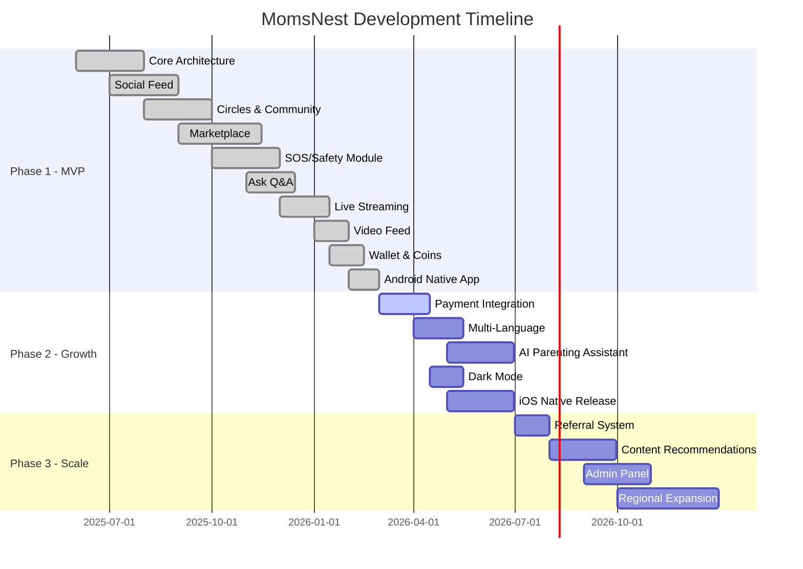
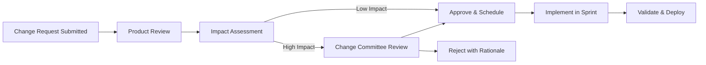

# 📊 MomsNest — Operational, Legal & Project Management Documentation

**Version:** 1.0  
**Date:** March 4, 2026  

---

# 📊 Part 1: Operational Documentation

---

## 1. Maintenance Plan

### Update Schedule
| Type | Frequency | Scope |
|------|-----------|-------|
| **Patch Updates** | Weekly | Bug fixes, minor UI improvements |
| **Feature Releases** | Bi-weekly (per sprint) | New features, enhancements |
| **Dependency Updates** | Monthly | npm packages, Supabase SDK |
| **Security Patches** | As needed (< 24h for critical) | Vulnerability fixes |
| **Database Migrations** | Per feature | Schema changes, indexes |
| **Capacitor Sync** | Per release | Native app asset updates |

### Bug Fix Process
1. Bug reported via internal tracking or user feedback
2. Severity classified (P0–P4)
3. Assigned to developer in sprint
4. Fix implemented, PR reviewed
5. Deployed to preview → verified → production
6. User notified (in-app update notifier)

### Feature Roadmap

#### Q1 2026 (Current) ✅
- [x] Social feed with multi-image posts
- [x] Community circles with events and services
- [x] Marketplace with checkout and seller dashboard
- [x] SOS/Safety module with helper network
- [x] Ask Q&A with AI insights
- [x] Live streaming (WebRTC)
- [x] Video feed with HLS streaming
- [x] Wallet/Coin economy
- [x] PWA + Android native app
- [x] Push notifications

#### Q2 2026 (Phase 2)
- [ ] Payment gateway integration (Chapa/Telebirr)
- [ ] Multi-language support (Amharic, English)
- [ ] AI parenting assistant
- [ ] Baby milestone tracker
- [ ] Enhanced seller verification (ID docs)
- [ ] iOS native app release
- [ ] Dark mode toggle

#### Q3 2026 (Phase 3)
- [ ] Referral system with coin rewards
- [ ] Scheduled/draft posts
- [ ] Premium circle subscriptions (paid)
- [ ] Content recommendations (ML)
- [ ] Web admin panel (moderation)
- [ ] Advanced analytics for sellers

#### Q4 2026 – H1 2027 (Scale)
- [ ] Regional expansion (Kenya, Tanzania)
- [ ] Video chat/audio rooms
- [ ] Automated content moderation
- [ ] B2B white-label for institutions
- [ ] Enterprise API for partners
- [ ] Medical professional onboarding

---

## 2. SLA (Service Level Agreement)

### Uptime Commitment
| Tier | Uptime | Downtime/Month |
|------|--------|----------------|
| **Target** | 99.9% | < 43 minutes |
| **Supabase SLA (Pro)** | 99.9% | < 43 minutes |
| **Cloudflare CDN** | 100% | Served from cache if origin fails |

### Support Response Times
| Priority | First Response | Resolution Target |
|----------|---------------|-------------------|
| **P0 — Critical** | 1 hour | 4 hours |
| **P1 — High** | 4 hours | 24 hours |
| **P2 — Medium** | 24 hours | 3 business days |
| **P3 — Low** | 48 hours | Next sprint |
| **P4 — Enhancement** | 1 week | Backlog |

---

## 3. Performance Benchmarking Report

### Web Performance Targets
| Metric | Target | Tool |
|--------|--------|------|
| **First Contentful Paint (FCP)** | < 1.5s | Lighthouse |
| **Largest Contentful Paint (LCP)** | < 2.5s | Lighthouse |
| **Time to Interactive (TTI)** | < 3.5s | Lighthouse |
| **Cumulative Layout Shift (CLS)** | < 0.1 | Lighthouse |
| **First Input Delay (FID)** | < 100ms | Web Vitals |
| **Bundle Size (gzip)** | < 500KB initial | Vite build |

### Optimization Techniques Applied
- **Code splitting:** Vite automatic chunk splitting
- **Image compression:** Client-side compression before upload (`imageCompression.ts`)
- **Lazy loading:** Components loaded on demand
- **Virtual scrolling:** Video feed with `useVideoVirtualization`
- **Query caching:** React Query 5-min stale, 30-min GC
- **Font optimization:** Google Fonts preconnect + display=swap
- **PWA caching:** Service worker with `vite-plugin-pwa`
- **Reduced motion:** Skip animations for users with preference

---

## 4. Load Testing Report (Planned)

### Test Scenarios
| Scenario | Concurrent Users | Actions |
|----------|------------------|---------|
| **Login storm** | 1,000 | Simultaneous sign-in |
| **Feed scrolling** | 5,000 | Paginated feed load |
| **Post creation** | 500 | Concurrent post + image upload |
| **SOS alert** | 100 | Simultaneous SOS + helper response |
| **Live stream** | 1,000 viewers | WebRTC stream with chat |

### Infrastructure Requirements for Scale
| Users | Database | Storage | Realtime |
|-------|----------|---------|----------|
| 1K–10K DAU | Supabase Pro | 10GB | 200 connections |
| 10K–50K DAU | Supabase Pro+ | 50GB + CDN | 1K connections |
| 50K–200K DAU | Supabase Enterprise | 200GB + Video CDN | 5K connections |

---

## 5. Code Documentation

### Inline Documentation
- TypeScript types provide self-documenting code
- 4,029-line auto-generated `types.ts` covers all database schema types
- JSDoc comments on key utility functions

### README
- Repository README covers setup, tech stack, and deployment
- Located at: `README.md`

### Versioning Strategy
| Component | Strategy |
|-----------|----------|
| **App Version** | Semantic Versioning (0.0.0 → 1.0.0 at launch) |
| **Database Schema** | Sequential migrations (69 files in `supabase/migrations/`) |
| **API** | Supabase API versioning (stable) |
| **Dependencies** | Pinned major versions with `^` for minor updates |
| **Cache Busting** | `cacheManager.ts` checks version on app load |

---

# 💼 Part 2: Legal Documentation

---

## 1. Privacy Policy (Template)

### Data Collected
| Data Type | Purpose | Stored |
|-----------|---------|--------|
| **Email & Password** | Authentication | Supabase Auth (hashed) |
| **Name & Profile Info** | User profiles | Supabase Database |
| **Profile Photos** | Avatar & cover images | Supabase Storage |
| **Posts & Media** | User-generated content | Supabase Database + Storage |
| **Location Data** | SOS alerts, shop items | Supabase Database (opt-in) |
| **Device Tokens** | Push notifications | Supabase Database (FCM token) |
| **Network Status** | Offline detection | Client-side only (not stored) |

### Data Sharing
- ❌ No sale of personal data to third parties
- ✅ Share with emergency contacts (SOS alerts, user-consented)
- ✅ Share with Supabase (infrastructure provider)
- ✅ Share with Mapbox (anonymized location for map tiles)
- ✅ Share with Firebase (push notification delivery)

### User Rights
- ✅ Right to access personal data
- ✅ Right to update personal data (edit profile)
- ✅ Right to delete account and data (implementation planned)
- ✅ Right to export data (implementation planned)
- ✅ Right to withdraw consent

---

## 2. Terms & Conditions (Template)

### Key Terms
1. **Eligibility:** Users must be 18+ years old
2. **Account Responsibility:** Users responsible for maintaining account security
3. **Content Ownership:** Users retain ownership of their content; grant MomsNest license to display
4. **Prohibited Content:** No hate speech, harassment, illegal activity, or explicit content
5. **Marketplace Terms:** MomsNest is a platform, not a party to buyer-seller transactions
6. **SOS Disclaimer:** MomsNest is not an emergency service; helpers are community volunteers
7. **Coin Policy:** Purchased coins are non-refundable; can be withdrawn as cash at conversion rate
8. **Intellectual Property:** App design, code, and branding are property of MomsNest
9. **Termination:** Right to suspend/terminate accounts violating terms
10. **Liability Limitation:** Platform liable only for direct damages caused by negligence

---

## 3. Data Processing Agreement (DPA)

### Sub-Processors
| Sub-Processor | Purpose | Data Access |
|---------------|---------|-------------|
| **Supabase Inc.** | Backend infrastructure | Full database access |
| **Cloudflare Inc.** | CDN and domain services | Cached content only |
| **Google/Firebase** | Push notifications | FCM tokens only |
| **Mapbox Inc.** | Map services | Anonymized location data |

---

## 4. Licensing Terms

| Component | License |
|-----------|---------|
| **MomsNest App** | Proprietary (All Rights Reserved) |
| **React** | MIT License |
| **Vite** | MIT License |
| **shadcn/ui** | MIT License |
| **Tailwind CSS** | MIT License |
| **Supabase Client** | MIT License |
| **Capacitor** | MIT License |
| **Mapbox GL JS** | BSD 3-Clause |
| **Lucide Icons** | ISC License |

---

# 🚀 Part 3: Project Management Documentation

---

## 1. Project Timeline



---

## 2. Sprint Planning

### Sprint Duration: 2 weeks

### Sprint Structure
| Day | Activity |
|-----|----------|
| Day 1 | Sprint planning, task breakdown |
| Day 2–9 | Development & testing |
| Day 10 | Code freeze, QA testing |
| Day 11 | Bug fixes, polish |
| Day 12 | Sprint review + retrospective |
| Day 13 | Deployment |
| Day 14 | Monitoring + sprint planning |

---

## 3. Task Breakdown Architecture

### Feature Development Process
```
Idea → PRD → Design → Implementation → Testing → Review → Deploy → Monitor
```

### Current Codebase Metrics
| Metric | Value |
|--------|-------|
| **Total Source Files** | 440+ |
| **React Components** | 173 |
| **Custom Hooks** | 76 |
| **Pages** | 32 |
| **Database Tables** | 48+ |
| **Database Migrations** | 69 |
| **Edge Functions** | 8 |
| **UI Components (shadcn)** | 51 |
| **Supabase Types File** | 4,029 lines |
| **Contexts** | 3 (User, Cart, Theme) |

---

## 4. Risk Log

| # | Risk | Status | Owner | Mitigation | Updated |
|---|------|--------|-------|------------|---------|
| R-01 | Payment integration complexity | 🟡 Open | Backend Lead | Research Chapa API, prototype | 2026-03-04 |
| R-02 | iOS build process (requires macOS) | 🟡 Open | Mobile Lead | Cloud build service or Mac access | 2026-03-04 |
| R-03 | Content moderation at scale | 🟡 Open | Product | AI moderation research | 2026-03-04 |
| R-04 | Data privacy regulations | 🟢 Monitoring | Legal | Quarterly compliance review | 2026-03-04 |
| R-05 | Supabase vendor lock-in | 🟢 Low | Architect | Abstraction layer, standard PostgreSQL | 2026-03-04 |
| R-06 | Video storage costs | 🟡 Open | Infrastructure | CDN optimization, compression | 2026-03-04 |

---

## 5. Change Request Process



### Change Request Categories
| Category | Approval Required | Lead Time |
|----------|-------------------|-----------|
| **Bug Fix** | Developer | Same sprint |
| **Minor Enhancement** | Product Owner | 1 sprint |
| **Major Feature** | Product + Engineering | 2+ sprints |
| **Architecture Change** | Engineering Committee | 3+ sprints |
| **Data Model Change** | Engineering + DBA | 2 sprints |

---

## 6. Product Roadmap (12–24 Months)

### 2026 Roadmap

| Quarter | Focus | Key Deliverables |
|---------|-------|-----------------|
| **Q1 2026** | ✅ MVP Complete | All core features live, Android app |
| **Q2 2026** | Growth & Polish | Payment integration, multi-language, iOS app |
| **Q3 2026** | Intelligence | AI assistant, content recommendations, admin panel |
| **Q4 2026** | Scale | Regional expansion, advanced analytics, partnerships |

### 2027 Roadmap

| Quarter | Focus | Key Deliverables |
|---------|-------|-----------------|
| **Q1 2027** | Enterprise | B2B white-label, API platform, institutional partners |
| **Q2 2027** | Innovation | Video calling, audio rooms, AR try-on (shop) |
| **Q3 2027** | Monetization | Premium tiers, advertising platform, sponsorships |
| **Q4 2027** | Global | Multi-region deployment, 10+ languages, 1M users |
